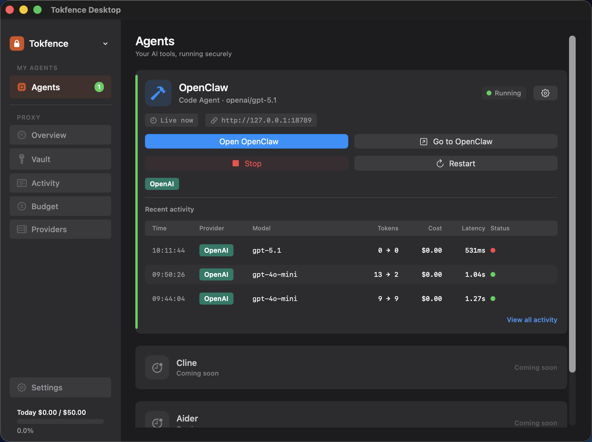
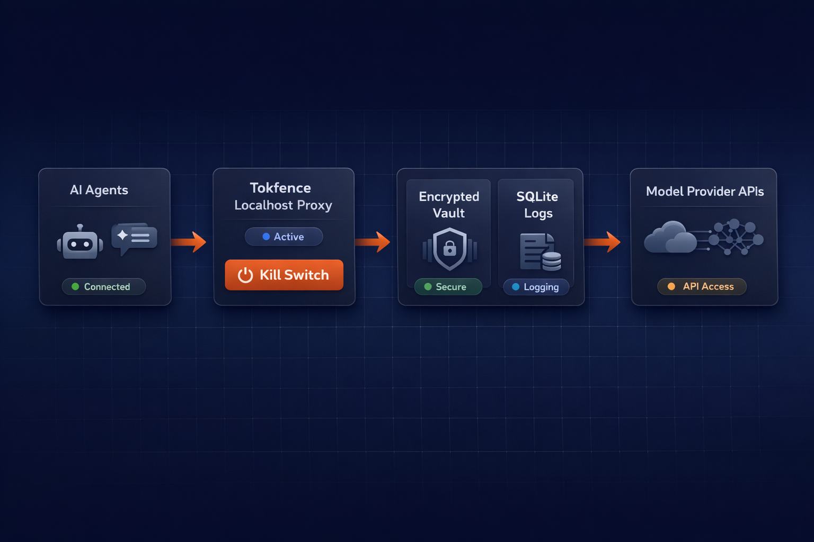
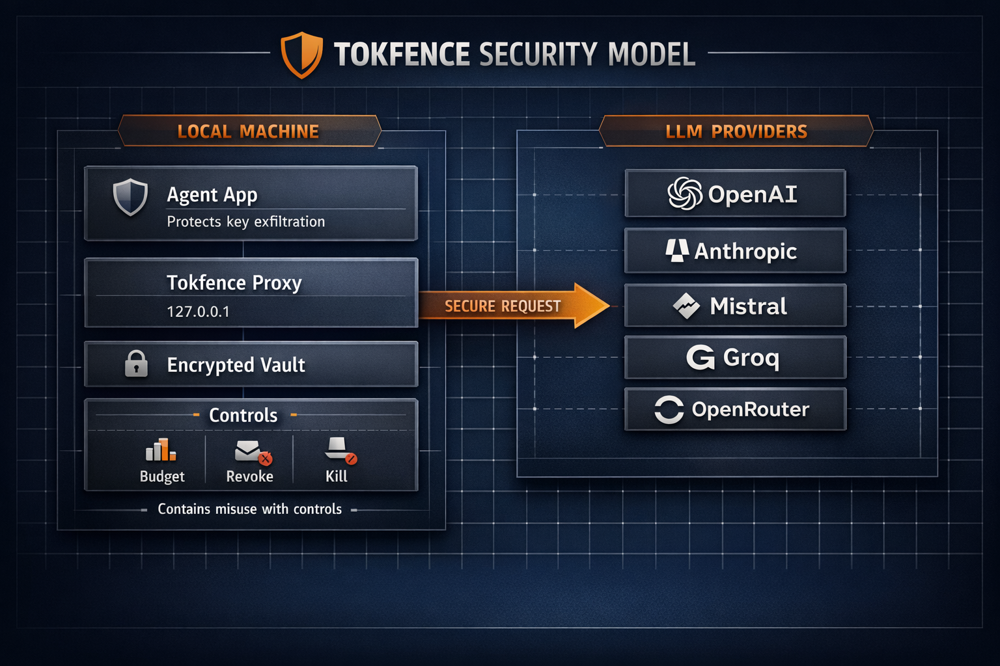
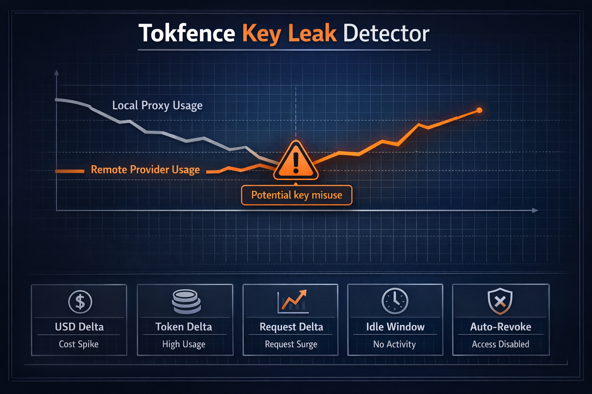
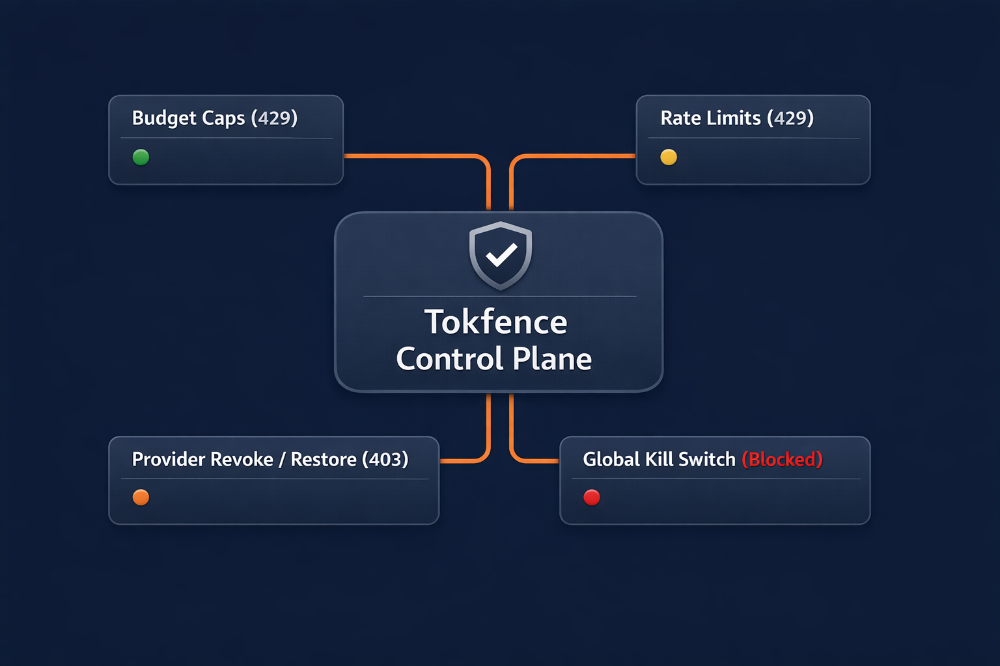
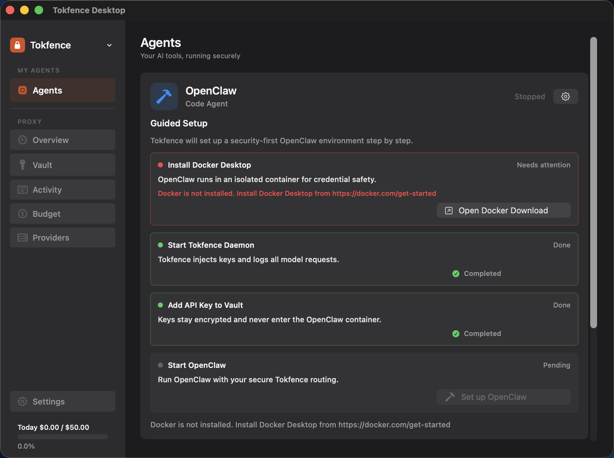
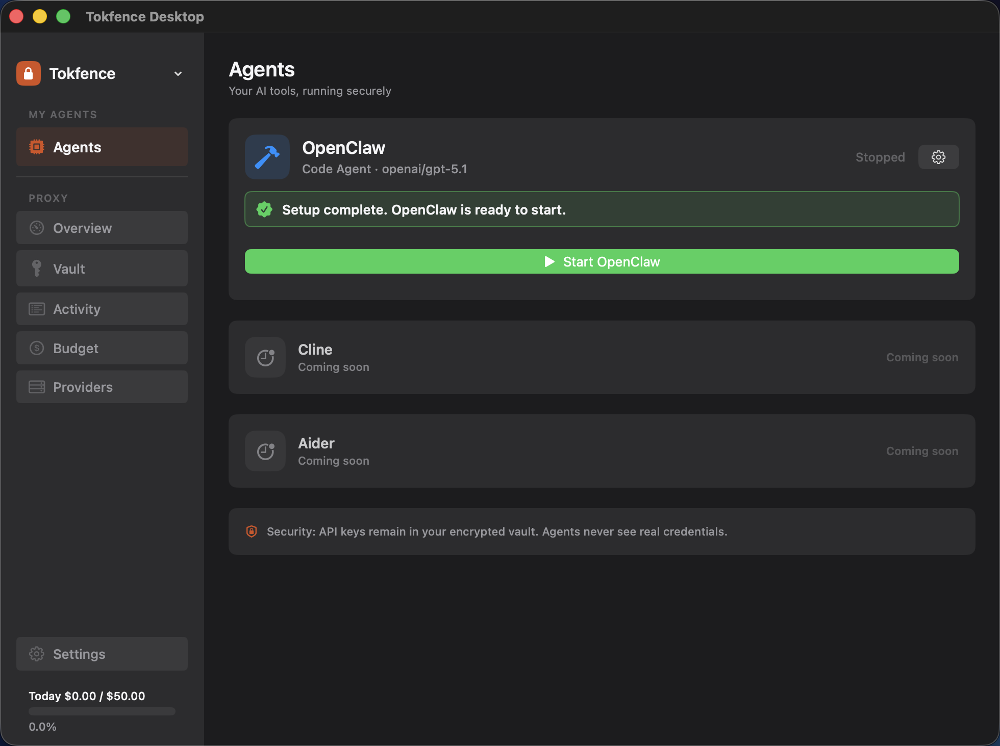

# Tokfence

**Your AI agent's API keys never leave the vault.**

Tokfence sits between your AI agents and provider APIs. Keys stay in an
encrypted vault (macOS Keychain / Argon2). Every request is logged, budgeted,
and rate-limited. One command to run OpenClaw with zero key exposure.

```bash
tokfence vault add openai sk-...
tokfence launch
# → OpenClaw opens. Keys stay in the vault. Done.
```

## Why

OpenClaw stores API keys in plaintext JSON. CVE-2026-25253 exfiltrated
them via 1-click RCE — 17,500 instances were exposed. Tokfence eliminates
this attack surface: the container never sees your real keys.

## What You Get

- **Encrypted vault** — Keys in macOS Keychain or Argon2-encrypted file, never in dotfiles.
- **Transparent proxy** — Every API call logged with model, tokens, cost, latency.
- **Budget caps** — `tokfence budget set openai daily 10.00` and it stops.
- **Kill switch** — `tokfence kill` cuts all API access instantly.
- **Leak detection** — `tokfence watch` monitors for exposed credentials.
- **One-click OpenClaw** — `tokfence launch` starts a secure OpenClaw in Docker.



Launch assets + E2E capture: `docs/launch/` (updated `2026-02-17`)

## Infographics

| Architecture | Security Model |
| --- | --- |
|  |  |

| Key Leak Detector | Control Plane |
| --- | --- |
|  |  |

Graphic source and regeneration notes: [`docs/launch/README.md`](docs/launch/README.md)

## Features

- Local proxy on `127.0.0.1:9471` with provider path routing.
- Vault-backed auth injection (macOS Keychain or encrypted file backend).
- SQLite request logs with model/tokens/latency/status/caller metadata.
- Cost estimation via embedded pricing map.
- Budget enforcement (`daily`/`monthly`) with HTTP 429 responses.
- Provider revocation and global `kill` / `unkill`.
- Per-provider RPM rate limiting.
- Key leak detector (`tokfence watch`) to compare provider-side usage vs Tokfence logs.
- Native-looking macOS menu UI via SwiftBar widget integration.

## Security Model

Tokfence protects against **key exfiltration** from agent config/runtime by keeping provider keys in a local vault and injecting auth at proxy time.

Important boundary:
- `127.0.0.1` binding limits network exposure, but it does not isolate local processes.
- UDS hardens localhost transport when `socket_path` is set: clients prefer `/tmp`/`~/.tokfence/tokfence.sock` with `0660` permissions.
- A compromised process on the same machine can still call the local proxy.
- ImmuneFence adds capability-gated request handling with endpoint/scope restrictions and a runtime risk machine:
  - `GREEN`: full scope
  - `YELLOW`: reduced scope + shorter capability TTL
  - `ORANGE`: safe-only routes
  - `RED`: request block/revoke behavior
- Budgets, revoke/restore, rate limits, and kill switch are the containment controls for this case.
- Canary-based output scanning helps detect suspicious leakage in responses (red risk state).

See [`SECURITY.md`](SECURITY.md) for the full threat model and disclosure policy.
Production-readiness gates: [`docs/product-readiness-checklist.md`](docs/product-readiness-checklist.md)

## Quickstart

```bash
# Build
go build -o tokfence ./cmd/tokfence

# Add keys (macOS keychain backend by default)
./tokfence vault add anthropic sk-ant-...
./tokfence vault add openai sk-...

# Start daemon
./tokfence start -d

# Configure shell
# Add this to your shell profile:
eval "$(./tokfence env)"

# Verify
./tokfence status
./tokfence log -f
```

For encrypted-file vault usage, set:

```bash
export TOKFENCE_VAULT_PASSPHRASE='your-strong-passphrase'
```

## macOS Distribution (Signing + Notarization)

Public shipping of the desktop app requires Apple code signing and notarization.

Required environment variables:

- `TEAM_ID` (Apple developer team identifier)
- `CODESIGN_IDENTITY` (e.g. `Developer ID Application: ...`)
- `NOTARIZATION_PROFILE` (configured `xcrun notarytool` profile)

Run from repo root:

```bash
TEAM_ID=ABCDE12345 \
CODESIGN_IDENTITY="Developer ID Application: Example" \
NOTARIZATION_PROFILE="tokfence-notary" \
make desktop-release
```

See [`docs/macos-desktop.md`](docs/macos-desktop.md) for the full release flow.

## Commands

```bash
# Daemon
tokfence start [-d]
tokfence stop
tokfence status

# Vault
tokfence vault add <provider> <key|->
tokfence vault remove <provider>
tokfence vault list
tokfence vault rotate <provider> <new-key|->
tokfence vault export
tokfence vault import <file>

# Observability
tokfence log [request-id]
tokfence log -f --provider openai --since 1h
tokfence stats --period 7d --by model

# Budget
tokfence budget set <provider|global> <amount_usd> <daily|monthly>
tokfence budget status
tokfence budget clear <provider|global>

# Control
tokfence revoke <provider>
tokfence restore <provider>
tokfence kill
tokfence unkill
tokfence ratelimit set <provider> <rpm>
tokfence ratelimit clear <provider>

# Shell integration
tokfence env [--shell bash|zsh|fish] [--provider <provider>]
tokfence provider set <provider> <upstream-url>
tokfence setup openclaw [--provider <provider>] [--test]
tokfence watch --period 24h --interval 15m
tokfence watch --once --provider openai --usage-endpoint openai=https://api.openai.com/v1/dashboard/billing/usage?start_date=2026-02-16&end_date=2026-02-16

# Desktop widget (SwiftBar)
tokfence widget install [--refresh 20]
tokfence widget render
tokfence widget uninstall
```

OpenClaw helper example:

```bash
tokfence setup openclaw --provider openai --test --json
```

This returns:
- the local proxy base URL for the selected provider
- a ready-to-paste `config.yaml` line
- readiness checks (`daemon_reachable`, `provider_has_key`) when `--test` is enabled

## Key Leak Detector (`tokfence watch`)

`tokfence watch` polls provider usage and reconciles it against local Tokfence logs for the same period.

If remote usage is higher than local usage beyond your thresholds, Tokfence raises an alert. In continuous mode, it also flags idle-time remote movement (no local traffic for `--idle-window`, but remote usage still increases).

Note: provider usage APIs may require organization/admin-scoped keys or billing permissions.
Note: provider usage endpoints can lag behind real-time traffic. Treat alerts as indicators that require confirmation, not absolute proof.

Examples:

```bash
# one-shot check as JSON
tokfence watch --once --provider anthropic --json

# continuous monitor every 15 minutes for all vault-backed providers
tokfence watch --period 24h --interval 15m

# auto-revoke on suspected leak
# warning: use carefully; usage API delays can produce false positives
tokfence watch --period 24h --interval 15m --auto-revoke

# endpoint override if provider usage API differs
tokfence watch --provider openai \
  --usage-endpoint openai=https://api.openai.com/v1/dashboard/billing/usage?start_date=2026-02-16&end_date=2026-02-16
```

## macOS Desktop UI (SwiftBar)

Install [SwiftBar](https://swiftbar.app/), then install the Tokfence widget:

```bash
tokfence widget install --refresh 20
```

The widget shows:
- daemon status (online/offline)
- today's requests, token totals, and estimated cost
- budget usage progress bars
- revoked providers and vault coverage
- one-click actions (`start`, `stop`, `kill`, `unkill`, logs, stats)

If your binary is not in `PATH`, pass it explicitly:

```bash
tokfence widget install --binary /absolute/path/to/tokfence
```

## Native macOS App + Widget (SwiftUI + WidgetKit)

This repository now includes a native desktop app and widget project at:
`apps/TokfenceDesktop`

It provides:
- a full SwiftUI dashboard app
- a WidgetKit extension for macOS widgets
- shared snapshot data loaded from `~/.tokfence/desktop_snapshot.json`

Generate and build:

```bash
make desktop-generate
make desktop-build
```

Then open:

```bash
open apps/TokfenceDesktop/TokfenceDesktop.xcodeproj
```

In the app:
1. Set the Tokfence binary path if needed.
2. Click `Refresh` to pull live status from `tokfence widget render --json`.
3. Add the Tokfence widget from macOS widget gallery.

## Desktop Preview

Current launch visuals are versioned in `docs/launch/` (snapshot set updated `2026-02-17`):

| Guided Setup (Missing Docker) | Guided Setup (Ready) | Runtime |
| --- | --- | --- |
|  |  |  |

Live E2E terminal capture: [`docs/launch/e2e_output.txt`](docs/launch/e2e_output.txt)

## Config

Default config path: `~/.tokfence/config.toml`

```toml
[daemon]
port = 9471
host = "127.0.0.1"

[logging]
db_path = "~/.tokfence/tokfence.db"
retention_days = 90

[notifications]
budget_warning_percent = 80
```

Provider defaults are embedded and can be overridden in `[providers.<name>]` blocks.

## Development

```bash
go test ./...
make build
make test
```

No external API calls are used in tests.

## Ship Verification (Live E2E)

Run a real end-to-end check with an actual provider key (never commit secrets):

```bash
export TOKFENCE_OPENAI_KEY='sk-...'
make smoke-e2e-openai
```

or for Anthropic:

```bash
export TOKFENCE_ANTHROPIC_KEY='sk-ant-...'
make smoke-e2e-anthropic
```

The smoke test does:

- builds tokfence binary (if needed)
- starts daemon on `127.0.0.1:9471` in background (if not running)
- stores the provider key in vault via `vault add <provider> -`
- sends one real streaming request through tokfence
- validates first SSE chunk arrives
- validates request is logged (streaming flag + status) and `stats` returns provider rows
- validates `tokfence widget render --json` returns a valid live snapshot

Expected output:

```
tokfence live smoke passed (provider=...)
```

Environment variables supported by `scripts/live-e2e.sh`:

- `TOKFENCE_BINARY` (default `./bin/tokfence`)
- `TOKFENCE_SMOKE_KEEP_DAEMON` (set `1` to keep daemon running after the run)
- `TOKFENCE_SMOKE_BUILD` (set `1` to rebuild binary every run)
